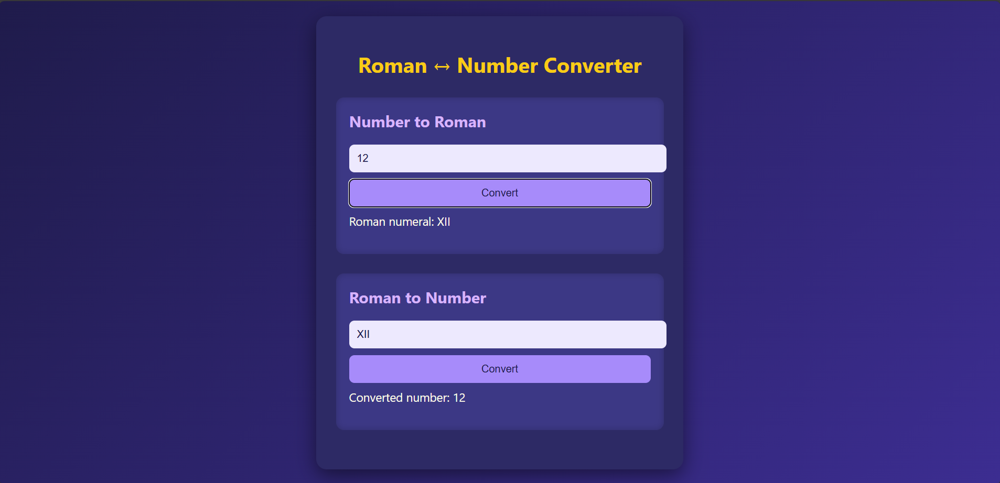

# 🏛️ Roman ↔ Number Converter

A simple yet functional web app to convert between decimal numbers and Roman numerals.

Built using **Vanilla JavaScript**, **HTML**, and **CSS**, this project demonstrates string manipulation, conditional logic, and DOM interaction — perfect for learning and showcasing core programming concepts.

---

## ✨ Features

- 🔢 **Number ➝ Roman Numeral** conversion
- 🏛️ **Roman Numeral ➝ Number** conversion
- ⚠️ Input validation (1–3999 and valid Roman letters)
- 🌙 Clean, dark-themed user interface
- 💡 No libraries or frameworks required

---

## 🚀 Live Demo

Try it here → [Live Demo](https://xvioz.github.io/roman-numeral-converter/)  

---

## 🛠 How to Run Locally
1. Clone or download the repository
2. Open index.html in your browser

---

No build steps, no setup — just open and use.

🧩 Technologies Used
HTML5 for structure

CSS3 for styling (dark & colorful theme)

JavaScript for logic and interaction

---

## 📁 Project Structure

roman-numeral-converter/
├── index.html         # Page layout
├── style.css          # Visual styling
├── script.js          # Conversion logic
└── README.md          # Documentation

---

## 💻 Code Examples
// Convert number to Roman numeral
convertToRoman(2025); // "MMXXV"

// Convert Roman numeral to number
romanToNumbers("CMXIV"); // 914

---

## 👨‍💻 Author
Made with ❤️ by Ofeleon Moreno
Feel free to fork, contribute, or give ⭐ if you like it!

---

## 📜 License
This project is licensed under the MIT License — you are free to use, modify, and share it.

---

Let me know if you'd like:

- A version with extra badges (like GitHub stars, license badge)
- A personalized section like “What I learned” or “Why I built this”
- A markdown-ready preview screenshot (I can help create one too)
